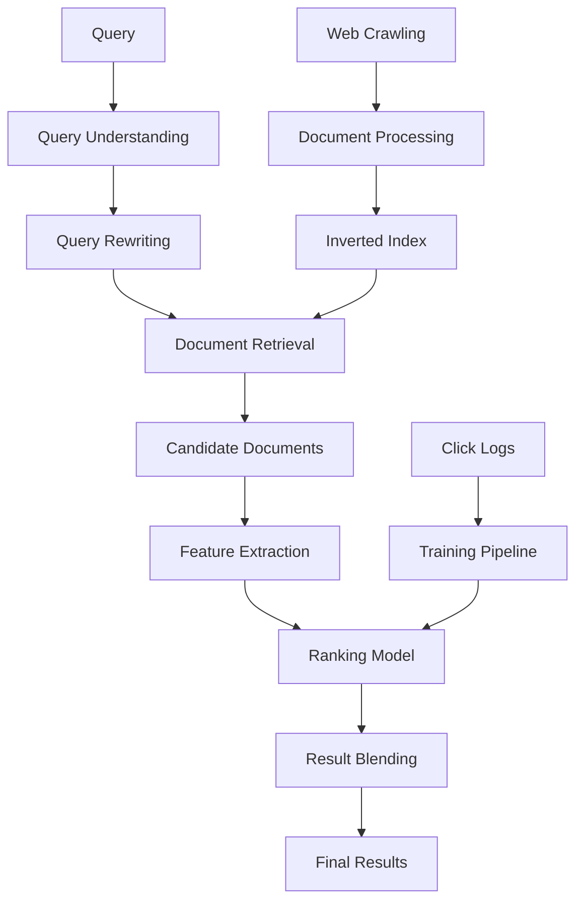

# Google Search Relevance System

## Intuition

Google processes 8+ billion search queries daily, requiring sub-200ms response times while delivering the most relevant results from trillions of web pages. The system must understand query intent, match with relevant documents, and rank results considering relevance, authority, and user context.

**Core Challenge**: Transform natural language queries into precise intent understanding, retrieve relevant documents from massive index, and rank results that satisfy user information needs while balancing multiple ranking factors.

**Business Context**:
- 90%+ global search market share depends on relevance quality
- $280B+ annual ad revenue tied to search satisfaction
- Query diversity spans 15% new queries daily
- Latency directly impacts user satisfaction and engagement

## When to Use / When Not to Use

**Use This Architecture When:**
- Massive document corpus (billions+ pages) with diverse content
- Complex queries requiring intent understanding and disambiguation  
- Sub-200ms latency requirements at global scale
- Multiple ranking factors (relevance, authority, freshness, personalization)
- Rich user context and behavioral signals available

**Avoid When:**
- Domain-specific search with limited vocabulary (use specialized ranking)
- Simple keyword matching sufficient (basic TF-IDF systems)
- Batch processing acceptable (internal document search)
- Limited query diversity (FAQ matching systems)
- Privacy-first requirements prevent behavioral tracking

## Metrics & Evaluation

**Primary Metrics:**
- **Relevance**: NDCG@10, MRR for top results quality
- **User Satisfaction**: Click-through rate, dwell time, query reformulation rate
- **Coverage**: Query success rate, zero-result queries percentage

**Business KPIs:**
- **User Engagement**: Sessions per user, query abandonment rate
- **Ad Performance**: Ad click-through rate correlation with organic quality  
- **Market Share**: Query volume growth, user retention

**Offline Evaluation:**
- **Ranking Metrics**: NDCG, MAP, ERR (Expected Reciprocal Rank)
- **Query Understanding**: Intent classification accuracy, entity extraction F1
- **Retrieval Quality**: Recall@1000, document relevance scores

**Online A/B Testing:**
- **User Behavior**: Click patterns, satisfaction surveys, task completion
- **Performance**: Query latency, result freshness, internationalization quality
- **Long-term**: User retention, query growth, competitor switching

**Evaluation Challenges:**
- **Subjectivity**: Relevance varies by user context and intent
- **Position Bias**: Users click higher-ranked results regardless of quality
- **Query Diversity**: Long-tail queries have limited training data
- **Temporal Changes**: Information needs evolve, content freshness matters

## Failure Modes

**Query Understanding Issues:**
- **Ambiguous Queries**: "Apple" could mean fruit, company, or location
- **Spelling Errors**: Typos, autocorrect failures, phonetic misspellings  
- **Intent Misclassification**: Informational vs transactional vs navigational queries
- **Language Detection**: Mixed language queries, transliteration errors

**Retrieval Problems:**
- **Recall Issues**: Relevant documents not retrieved from index
- **Index Staleness**: Fresh content not yet crawled and indexed
- **Spam/Low Quality**: Irrelevant documents ranking highly
- **Geographic Bias**: Results not localized properly for user location

**Ranking Failures:**
- **Authority vs Relevance**: Authoritative but irrelevant pages ranking high
- **Freshness Tradeoffs**: New content ranking over more relevant older content
- **Personalization Errors**: User profile inaccuracies affecting rankings
- **Click Feedback Loops**: Popular results get more clicks, become more popular

**System Performance:**
- **Latency Spikes**: Query complexity, index serving issues, network problems
- **Index Inconsistency**: Different data centers serving different results
- **Feature Lag**: Real-time signals (trending topics) not incorporated quickly
- **Cascade Failures**: Dependency failures affecting entire serving pipeline

## Debug Playbook

**Relevance Quality Drops:**
1. **Query Analysis**: Check query understanding accuracy, intent classification
2. **Ranking Features**: Monitor feature importance, check for feature drift  
3. **Index Quality**: Verify document freshness, spam detection effectiveness
4. **User Feedback**: Analyze click patterns, satisfaction metrics, query reformulations

**Latency Increases:**
1. **Query Complexity**: Check for expensive query types, long query processing
2. **Index Serving**: Monitor shard performance, cache hit rates, disk I/O
3. **Network Issues**: Check data center connectivity, CDN performance
4. **Feature Computation**: Real-time feature extraction bottlenecks

**Coverage Issues (Zero Results):**
1. **Query Understanding**: Spelling correction, synonym expansion effectiveness
2. **Index Coverage**: Check crawling completeness, document inclusion rates
3. **Retrieval Thresholds**: Adjust minimum relevance scores for retrieval
4. **Long-tail Handling**: Fallback strategies for rare queries

**Ranking Inconsistencies:**
1. **Model Serving**: Check model version consistency across data centers
2. **Feature Consistency**: Verify real-time vs batch feature alignment
3. **A/B Test Interference**: Multiple experiments affecting same queries
4. **Regional Differences**: Localization quality, cultural relevance factors

## System / Serving Notes

**Architecture Overview:**

**Query Processing Pipeline:**
- **Query Understanding**: Intent classification, entity recognition, spelling correction
- **Query Expansion**: Synonyms, related terms, personalization signals
- **Retrieval**: Inverted index lookup, semantic matching, real-time filtering

**Document Retrieval:**
- **Inverted Index**: Term-document mapping optimized for fast lookup
- **Semantic Matching**: Dense embeddings for conceptual similarity
- **Filtering**: Freshness, spam detection, safety filtering
- **Candidate Generation**: ~1000 documents per query for ranking

**Ranking Pipeline:**
- **Feature Engineering**: Page authority, content quality, user context, query-document matching
- **Model Architecture**: Large-scale neural networks (BERT-based) + gradient boosting
- **Multi-objective**: Relevance, diversity, freshness, user satisfaction
- **Personalization**: Search history, location, device, time context

**Serving Infrastructure:**
- **Latency Target**: P99 < 150ms for complete search results
- **Throughput**: 100K+ queries per second globally
- **Availability**: 99.99% uptime with geographic load balancing
- **Index Distribution**: Sharded across multiple data centers

**Training Pipeline:**
- **Data Sources**: Click logs, human rater judgments, content analysis
- **Label Generation**: Click-through rates, dwell time, user satisfaction signals
- **Model Training**: Distributed training on TPUs, continuous learning
- **Evaluation**: Offline metrics + online A/B testing

**Monitoring & Quality:**
- **Relevance Monitoring**: Real-time quality metrics, human evaluation
- **Performance Tracking**: Latency, availability, error rates
- **Content Quality**: Spam detection, misinformation identification  
- **User Satisfaction**: Survey data, behavioral analysis

## Interview Questions

<strong>Rapid-Fire Q&A (Click to expand)</strong>

**Q1: How would you handle the query "Apple" which could mean fruit, company, or location?**
A: Use query context (previous searches, location), entity disambiguation with knowledge graphs, personalization signals, and show diverse results covering multiple interpretations.

**Q2: Your search latency spikes to 500ms during peak traffic. Debug approach?**
A: Check: (1) Index serving performance, (2) Query complexity distribution, (3) Cache hit rates, (4) Network latency between data centers, (5) Feature extraction bottlenecks.

**Q3: How do you prevent click feedback loops where popular results become more popular?**
A: Position bias correction in training, explore-exploit strategies for ranking, diversity injection, and separate popularity signals from relevance signals.

**Q4: Design the training pipeline for a search ranking model.**
A: (1) Collect click logs and human judgments, (2) Generate query-document pairs with labels, (3) Extract features (text, authority, freshness), (4) Train ranking model with listwise loss, (5) Validate with offline metrics + online A/B test.

**Q5: How would you handle spelling errors in search queries?**
A: Multi-layer approach: (1) Edit distance algorithms for common typos, (2) Phonetic matching for pronunciation errors, (3) Context-aware correction using query logs, (4) Machine learning models for complex corrections.

**Q6: A new website should rank highly but doesn't appear in results. What could be wrong?**
A: Check: (1) Crawling issues (robots.txt, server errors), (2) Index inclusion delays, (3) Content quality filters, (4) Authority signals, (5) Spam detection false positives.

**Q7: How do you balance freshness vs authority in search results?**
A: Multi-objective ranking function with freshness features, query-dependent freshness requirements (news vs evergreen content), and temporal boost for time-sensitive queries.

**Q8: Design A/B testing for a new ranking algorithm.**
A: (1) Query-level randomization, (2) Stratify by query type and frequency, (3) Monitor relevance metrics + user satisfaction, (4) Check for novelty effects, (5) Measure long-term user engagement.

**Q9: How would you scale search indexing to handle 10x more web content?**
A: (1) Distributed crawling with priority queues, (2) Horizontal index sharding, (3) Incremental index updates, (4) Parallel document processing, (5) Content deduplication and filtering.

**Q10: Your search model shows great offline metrics but poor user satisfaction. Why?**
A: (1) Position bias in training data, (2) Offline metrics don't capture user intent diversity, (3) Missing real-time signals in offline evaluation, (4) Label quality issues in training data, (5) Evaluation dataset not representative of live traffic.

## Related

- [Information Retrieval](../02-deep-learning/information-retrieval.md)
- [Learning to Rank](../02-deep-learning/learning-to-rank.md)
- [BERT and Transformers](../02-deep-learning/transformers.md)
- [Large Scale ML Systems](../03-ml-systems/large-scale-systems.md)
- [A/B Testing for ML](../03-ml-systems/ab-testing-ml.md)
- [Real-time ML Systems](../03-ml-systems/real-time-systems.md)
- [Feature Engineering](../01-supervised-learning/feature-engineering.md)
- [Netflix Recommendation Ranking](./netflix-recommendation-ranking.md)
- [Meta Fraud Detection](./meta-fraud-detection.md)
