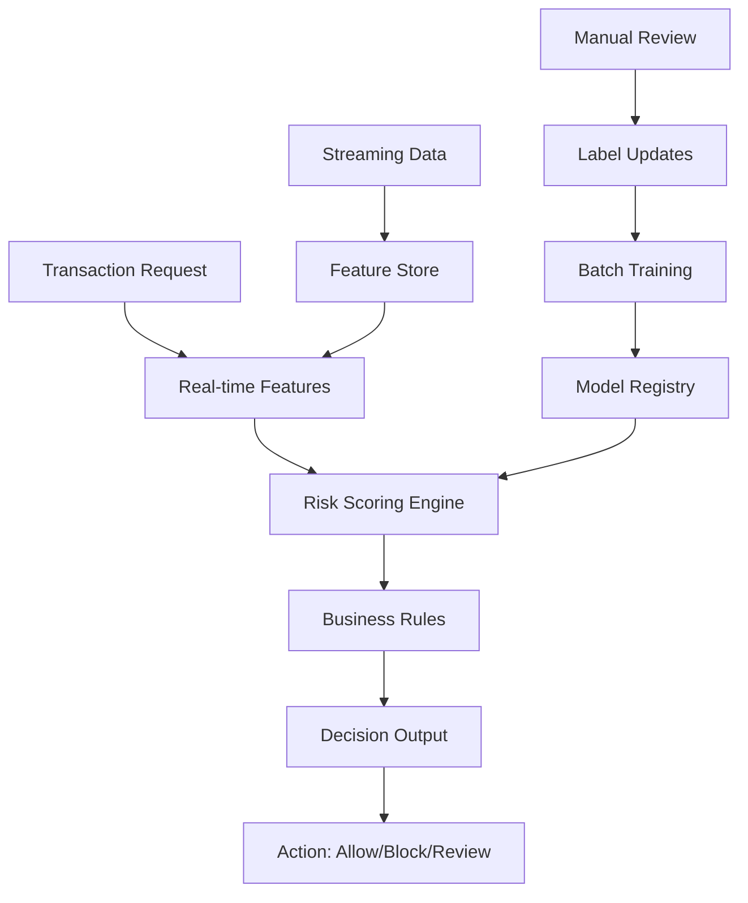

# Meta Fraud Detection System

## Intuition

Meta processes billions of payment transactions daily across Facebook, Instagram, and WhatsApp. The fraud detection system must identify fraudulent transactions in real-time (<100ms) while maintaining low false positive rates to avoid blocking legitimate users.

**Core Challenge**: Distinguish legitimate transactions from sophisticated fraud attempts using behavioral patterns, device fingerprinting, and network analysis while adversaries continuously evolve their tactics.

**Business Context**:
- $100B+ annual payment volume requires 99.9%+ accuracy
- False positives cost user trust and revenue ($10M+ daily impact)
- Regulatory requirements (PCI DSS, anti-money laundering)
- Adversarial environment with organized fraud networks

## When to Use / When Not to Use

**Use This Architecture When:**
- High-volume transactions (>1M daily) with financial impact
- Real-time decisioning requirements (<100ms P99)
- Adversarial environment with evolving attack patterns
- Rich feature ecosystem (behavioral, device, network data)
- Regulatory compliance requirements

**Avoid When:**
- Low-risk transactions with minimal financial impact
- Batch processing acceptable (daily fraud analysis)
- Limited feature data available
- Simple rule-based systems sufficient
- Privacy constraints prevent behavioral tracking

## Metrics & Evaluation

**Primary Metrics:**
- **Precision/Recall**: Fraud caught vs false positives (target: 95%+ precision, 85%+ recall)
- **Financial Impact**: Dollars saved vs revenue blocked
- **Latency**: Transaction decision time (P99 < 50ms)

**Business KPIs:**
- **Loss Rate**: Fraud losses as % of transaction volume (<0.1%)
- **False Positive Rate**: Legitimate transactions blocked (<0.05%)
- **Appeal Success**: % of blocked transactions overturned on appeal

**Model Performance:**
- **AUC-ROC**: Overall discriminative ability (>0.98 target)
- **AUC-PR**: Performance on imbalanced data (fraud rate ~0.1%)
- **Stability**: Performance consistency across time windows

**Operational Metrics:**
- **Coverage**: % transactions scored in real-time
- **Fallback Rate**: % using rule-based backup systems
- **Model Freshness**: Time since last training update

**Evaluation Challenges:**
- **Label Delay**: Fraud confirmed days/weeks later
- **Adversarial Feedback**: Fraudsters adapt to detection patterns  
- **Class Imbalance**: 1 fraud per 1000+ legitimate transactions
- **Cost Asymmetry**: False negatives cost 100x more than false positives

## Failure Modes

**Adversarial Attacks:**
- **Model Evasion**: Fraudsters reverse-engineer detection patterns
- **Data Poisoning**: Attackers inject false training examples
- **Adaptive Attacks**: Fraud patterns evolve faster than model updates
- **Coordinated Networks**: Distributed attacks across multiple accounts

**Data Quality Issues:**
- **Feature Drift**: User behavior changes, device fingerprints evolve
- **Label Noise**: Confirmed fraud cases have reporting delays/errors
- **Sampling Bias**: Training data doesn't represent all fraud types
- **Geographic Skew**: Models trained on US data fail in other regions

**System Failures:**
- **Latency Spikes**: Feature computation timeouts, fallback to rules
- **Model Serving**: Inconsistent scores between training and inference
- **Feature Store**: Missing or stale features for real-time decisions
- **Cascade Failures**: Upstream service failures block transaction processing

**Business Impact:**
- **False Positive Surge**: Legitimate users blocked, customer support overwhelmed
- **Fraud Evolution**: New attack vectors bypass existing detection
- **Regulatory Issues**: Compliance failures, audit findings
- **Reputation Damage**: Public fraud incidents, media attention

## Debug Playbook

**Precision Drop (More False Positives):**
1. **Feature Drift Analysis**: Compare feature distributions across time
2. **User Behavior Changes**: Check for seasonal patterns, product changes
3. **Model Staleness**: Verify training data freshness, retrain frequency
4. **Threshold Calibration**: Adjust decision thresholds based on business cost

**Recall Drop (Missing Fraud):**
1. **New Attack Patterns**: Analyze recent fraud cases for novel techniques
2. **Feature Engineering**: Check if existing features capture new fraud signals
3. **Model Complexity**: Consider ensemble methods, deep learning approaches
4. **Label Quality**: Verify fraud confirmation process, label accuracy

**Latency Spikes:**
1. **Feature Computation**: Check real-time feature calculation performance
2. **Model Inference**: Monitor prediction service load, scaling policies
3. **Database Queries**: Optimize feature lookups, add caching layers
4. **Network Issues**: Check connectivity between services

**Model Performance Degradation:**
1. **Concept Drift**: Compare fraud patterns over time windows
2. **Training Data Quality**: Check for label leakage, temporal consistency
3. **Feature Importance**: Monitor which features drive predictions
4. **A/B Test Results**: Isolate model performance from product changes

## System / Serving Notes

**Architecture Overview:**

**Real-time Scoring Pipeline:**
- **Feature Engineering**: Device fingerprinting, velocity checks, network analysis
- **Model Ensemble**: XGBoost + Neural Networks + Rules for different fraud types
- **Risk Scoring**: Multi-model outputs combined with business logic
- **Decision Engine**: Risk thresholds with manual review queues

**Feature Categories:**
- **Behavioral**: Transaction patterns, timing, amounts, merchant categories
- **Device**: Browser fingerprints, mobile device IDs, location consistency  
- **Network**: IP reputation, proxy detection, geolocation analysis
- **Historical**: User transaction history, previous fraud indicators
- **Real-time**: Current session behavior, velocity across accounts

**Model Architecture:**
- **Gradient Boosting**: XGBoost/LightGBM for interpretable feature importance
- **Deep Learning**: Neural networks for complex pattern detection  
- **Graph Models**: Network analysis for coordinated fraud detection
- **Ensemble**: Weighted combination based on fraud type detection

**Serving Infrastructure:**
- **Latency Target**: P99 < 50ms for transaction decisions
- **Throughput**: 100K+ transactions per second peak capacity
- **Availability**: 99.99% uptime with graceful degradation
- **Caching**: User profiles, device fingerprints, IP reputation data

**Training Pipeline:**
- **Data Sources**: Transaction logs, device data, manual review outcomes
- **Label Pipeline**: Delayed fraud confirmations, chargeback data
- **Feature Store**: Real-time streaming features + batch computed features
- **Model Training**: Daily retaining on fraud patterns, weekly full retraining

**Monitoring & Alerting:**
- **Business Metrics**: Real-time fraud loss tracking, false positive rates
- **Model Performance**: AUC degradation, precision/recall shifts
- **System Health**: Latency monitoring, feature availability, error rates
- **Adversarial Detection**: Novel attack pattern identification

## Interview Questions

<strong>Rapid-Fire Q&A (Click to expand)</strong>

**Q1: How do you handle class imbalance in fraud detection (0.1% fraud rate)?**
A: Use techniques like SMOTE for upsampling, cost-sensitive learning with class weights, precision-recall curves instead of ROC, and ensemble methods that handle imbalance well.

**Q2: A new fraud pattern emerges that your model doesn't catch. How do you adapt quickly?**
A: (1) Emergency rule deployment for immediate coverage, (2) Fast model retraining with new labeled data, (3) Active learning to identify similar cases, (4) Feature engineering for new attack vectors.

**Q3: How would you design features for device fingerprinting?**
A: Browser/OS details, screen resolution, timezone, installed fonts, WebGL renderer, canvas fingerprinting, hardware specs, and behavioral patterns like typing speed/mouse movements.

**Q4: Your fraud model has 95% precision but only 60% recall. How do you improve recall?**
A: (1) Lower decision threshold, (2) Add more fraud-specific features, (3) Use ensemble methods, (4) Implement active learning for edge cases, (5) Create fraud-type-specific models.

**Q5: How do you prevent fraudsters from reverse engineering your model?**
A: (1) Model ensembles with different architectures, (2) Random feature subsampling, (3) Adversarial training, (4) Feedback loops to detect probing, (5) Separate models for different fraud types.

**Q6: Design a real-time feature store for fraud detection.**  
A: (1) Kafka streams for real-time events, (2) Redis for fast feature lookup, (3) Spark for batch feature computation, (4) Feature versioning and A/B testing, (5) Monitoring for feature drift.

**Q7: How would you handle false positives affecting legitimate high-value customers?**
A: Customer segmentation with different thresholds, VIP allowlists, human review workflows for high-value accounts, and feedback loops to learn from appeals.

**Q8: A fraudster creates 1000 fake accounts. How does your system detect this?**
A: Network analysis features (shared devices/IPs), velocity checks (account creation rate), behavioral similarity detection, and graph-based models to identify coordinated networks.

**Q9: How do you evaluate your fraud model when labels are delayed by weeks?**
A: Use proxy labels (user complaints, chargebacks), semi-supervised learning, temporal cross-validation with proper time gaps, and continuous model monitoring.

**Q10: Design the monitoring system for a fraud detection model in production.**
A: (1) Real-time dashboards for precision/recall, (2) Feature drift detection, (3) Model performance alerts, (4) Business impact tracking, (5) Adversarial attack detection, (6) System latency monitoring.

## Related

- [Imbalanced Classification](../01-supervised-learning/imbalanced-classification.md)
- [Feature Engineering](../01-supervised-learning/feature-engineering.md)
- [Model Serving Architecture](../03-ml-systems/model-serving.md) 
- [Real-time ML Systems](../03-ml-systems/real-time-systems.md)
- [Adversarial ML](../01-supervised-learning/adversarial-ml.md)
- [Cost-Sensitive Learning](../01-supervised-learning/cost-sensitive.md)
- [Ensemble Methods](../01-supervised-learning/ensemble-methods.md)
- [Netflix Recommendation Ranking](./netflix-recommendation-ranking.md)
- [Google Search Relevance](./google-search-relevance.md)
