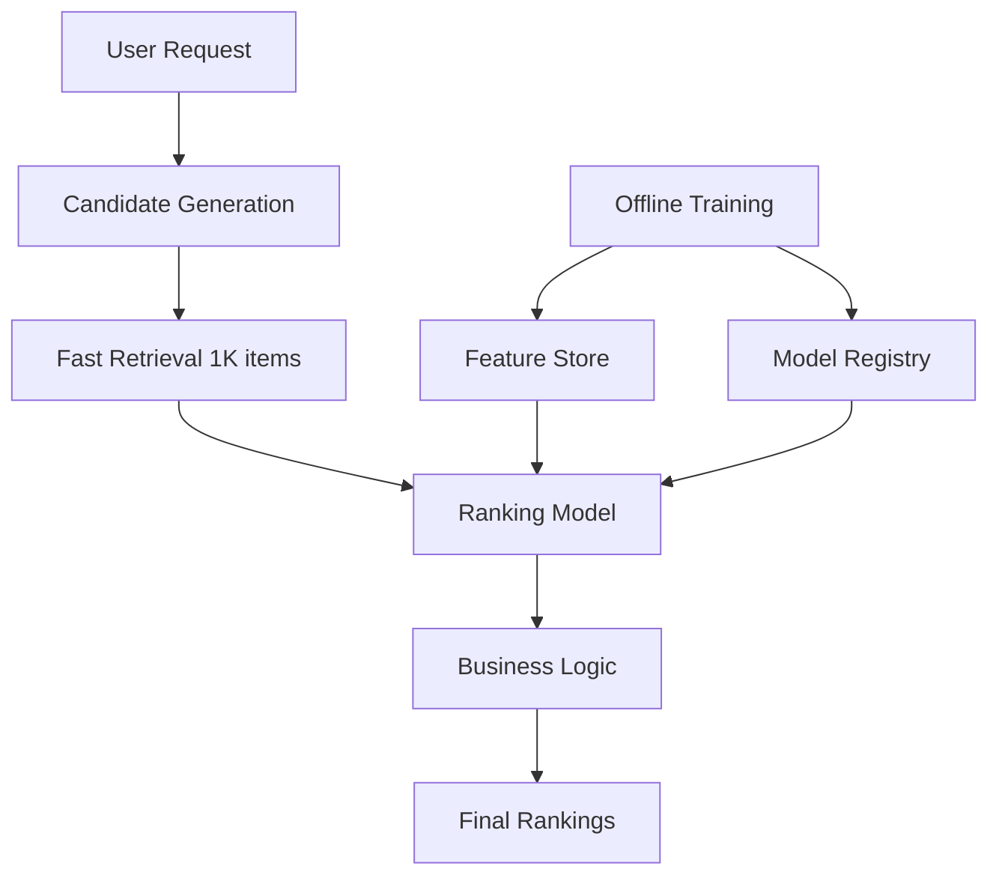

# Netflix Recommendation Ranking System

## Intuition

Netflix's recommendation system serves 200M+ users, generating 80% of content consumption through personalized rankings. The system must balance relevance, diversity, and business objectives while handling massive scale and real-time constraints.

**Core Challenge**: Transform user preferences and content catalog into personalized rankings that maximize engagement while avoiding filter bubbles and promoting content discovery.

**Business Context**: 
- $15B+ content investment requires optimal allocation
- Recommendation quality directly impacts churn (saves ~$1B annually)
- Must balance user satisfaction with content promotion goals

## When to Use / When Not to Use

**Use This Architecture When:**
- Catalog size > 10K items with rich metadata
- User base > 1M with diverse consumption patterns  
- Real-time serving requirements (<200ms P99)
- Business needs content promotion capabilities
- Multiple content types (movies, series, documentaries)

**Avoid When:**
- Simple e-commerce with <1K SKUs (use collaborative filtering)
- No behavioral data available (cold start problem)
- Batch recommendations sufficient (daily/weekly updates)
- Regulatory constraints prevent behavioral tracking

## Metrics & Evaluation

**Primary Metrics:**
- **Engagement Rate**: CTR, completion rate, time-to-next-watch
- **Session Metrics**: Session length, content variety per session
- **Business KPIs**: Subscriber retention, content ROI, catalog coverage

**Offline Evaluation:**
- **Ranking Metrics**: NDCG@10, MRR, MAP for top recommendations
- **Diversity Metrics**: Intra-list diversity, catalog coverage, freshness
- **Bias Metrics**: Popularity bias, demographic fairness, geographic balance

**Online A/B Testing:**
- **Guardrail Metrics**: Total watch time, subscriber satisfaction scores
- **Innovation Metrics**: Discovery rate of new content, genre exploration
- **Segment Analysis**: Performance across user cohorts, content types

**Offline-Online Alignment Challenges:**
- Offline metrics optimize for known preferences vs online discovery
- Position bias in historical data affects offline evaluation
- Seasonal content preferences not captured in offline data

## Failure Modes

**Data Quality Issues:**
- **Popularity Bias**: New content gets buried, long-tail never surfaces
- **Cold Start**: New users see only popular content, poor initial experience
- **Filter Bubbles**: Users stuck in narrow content categories

**Model Performance:**
- **Staleness**: User preferences evolve faster than model updates
- **Position Bias**: Model learns that position predicts clicks, not relevance  
- **Feedback Loops**: Popular content gets more exposure, becomes more popular

**System Failures:**
- **Latency Spikes**: Candidate generation timeouts, fallback to popularity
- **Model Serving**: Inconsistent scores between training and serving
- **A/B Test Interference**: Multiple experiments affecting same user cohorts

**Business Impact:**
- **Content Cannibalization**: New releases hurt catalog diversity metrics
- **Revenue Conflicts**: User preferences vs content promotion goals
- **Seasonal Drift**: Holiday/event content skews model performance

## Debug Playbook

**Engagement Drops:**
1. **Check Data Freshness**: User events, content metadata, model features
2. **Monitor Position Bias**: Compare click rates across carousel positions
3. **Analyze Content Mix**: Diversity metrics, new vs catalog content ratio
4. **Segment Analysis**: Performance by user tenure, demographics, device

**Latency Issues:**
1. **Candidate Generation**: Check retrieval service performance, index freshness
2. **Scoring Pipeline**: Monitor model inference time, feature lookup latency
3. **Caching Effectiveness**: Hit rates for user profiles, content embeddings
4. **Fallback Triggers**: Frequency of popularity-based fallbacks

**Model Quality Regression:**
1. **Feature Drift**: Compare feature distributions training vs serving
2. **Label Quality**: Check implicit feedback signal consistency
3. **Training Data**: Verify data pipeline, check for label leakage
4. **A/B Test Results**: Isolate model changes from product changes

**Content Promotion Issues:**
1. **Business Rule Conflicts**: Check promotion targets vs user preferences
2. **Freshness Balance**: New content exposure vs established preferences
3. **Catalog Coverage**: Monitor long-tail content recommendation rates

## System / Serving Notes

**Architecture Overview:**

**Candidate Generation:**
- **Two-Tower Model**: User/content embeddings for fast retrieval
- **Multiple Retrievers**: Collaborative filtering, content-based, trending
- **Retrieval Fusion**: Combine ~1000 candidates from different sources

**Ranking Pipeline:**
- **Feature Engineering**: Real-time user context, content metadata, temporal features
- **Model Architecture**: Gradient boosted trees (XGBoost/LightGBM) for interpretability
- **Scoring**: Multi-objective optimization (engagement + diversity + business)

**Serving Infrastructure:**
- **Latency Target**: P99 < 150ms for personalized rankings
- **Caching Strategy**: User embeddings (1hr TTL), content features (24hr TTL)
- **Fallback Systems**: Popularity-based, collaborative filtering, trending content
- **Load Balancing**: Geographic routing, A/B test traffic splitting

**Training Pipeline:**
- **Data Sources**: Viewing events, ratings, search queries, content metadata
- **Label Definition**: Implicit feedback (watch time, completion) + explicit ratings
- **Training Frequency**: Daily for trending signals, weekly for deep models
- **Feature Store**: Real-time features via Kafka, batch features via Spark

**Monitoring & Alerting:**
- **Business Metrics**: Real-time engagement dashboards, retention tracking
- **Technical Metrics**: Latency P99, error rates, cache hit rates
- **Model Quality**: Daily offline evaluation, drift detection
- **Content Coverage**: Catalog diversity, long-tail recommendation rates

## Interview Questions

<strong>Rapid-Fire Q&A (Click to expand)</strong>

**Q1: How would you handle the cold start problem for new users?**
A: Hybrid approach: (1) Onboarding with explicit preferences, (2) Demo-based recommendations using similar users, (3) Popular content with diversity constraints, (4) Fast learning from first few interactions.

**Q2: Your recommendation latency suddenly spikes to 500ms. Debug approach?**
A: Check: (1) Candidate generation service health, (2) Model serving infrastructure load, (3) Feature store latency, (4) Database connection pools, (5) Switch to cached fallback if needed.

**Q3: How do you prevent filter bubbles while maintaining engagement?**
A: Multi-objective optimization: engagement score + diversity penalty + exploration bonus. Use epsilon-greedy for some recommendation slots. Monitor genre/category diversity metrics.

**Q4: Design the training pipeline for a recommendation model.**
A: (1) Stream events via Kafka, (2) Feature engineering in Spark, (3) Generate labels from implicit feedback, (4) Train on distributed GPUs, (5) Validate with holdout temporal split, (6) Deploy via A/B test.

**Q5: How would you measure recommendation diversity without hurting engagement?**
A: Track intra-list diversity (cosine similarity between items), catalog coverage (% items recommended), and user exploration (new genres discovered) alongside CTR/watch time.

**Q6: A new movie release isn't getting recommended. What could be wrong?**
A: Check: (1) Content metadata ingestion, (2) Cold start handling for new items, (3) Popularity bias in model, (4) Business promotion rules, (5) Content quality filters.

**Q7: How do you handle seasonal content preferences (holidays, events)?**
A: Temporal features in model, seasonal content boosting rules, trending content signals, and separate models for time-sensitive content categories.

**Q8: Design A/B testing for a recommendation algorithm change.**
A: (1) User-level randomization, (2) Guardrail metrics (total watch time), (3) Primary metrics (CTR, session length), (4) Segment analysis, (5) Statistical significance testing, (6) Long-term retention tracking.

**Q9: How would you scale this system to handle 10x more users?**
A: (1) Distributed candidate generation, (2) Model serving sharding by user cohorts, (3) Caching layers (Redis clusters), (4) Asynchronous pre-computation, (5) Geographic data replication.

**Q10: Your model shows great offline metrics but poor online performance. Why?**
A: (1) Position bias in training data, (2) Feedback loop effects not captured offline, (3) Serving-training skew in features, (4) Different user behavior in A/B test vs historical data, (5) Temporal data leakage.

## Related

- [Learning to Rank Algorithms](../02-deep-learning/learning-to-rank.md)
- [Feature Stores](../03-ml-systems/feature-stores.md) 
- [Model Serving Architecture](../03-ml-systems/model-serving.md)
- [A/B Testing for ML](../03-ml-systems/ab-testing-ml.md)
- [Recommendation System Metrics](../01-supervised-learning/recommendation-metrics.md)
- [Cold Start Problem](../01-supervised-learning/cold-start.md)
- [Bias and Fairness](../01-supervised-learning/bias-fairness.md)
- [Meta Fraud Detection](./meta-fraud-detection.md)
- [Google Search Relevance](./google-search-relevance.md)
