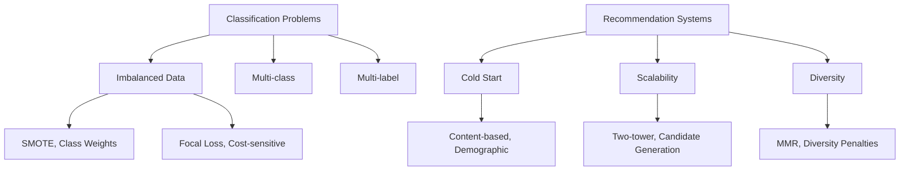

# 🧠 Applied ML Interview Memory Bank

> **Your centralized knowledge index for Senior→Staff Applied ML interviews**

This memory bank provides instant access to all concepts, cross-references, progress tracking, and quick lookups across your interview prep materials.

## 🗂️ Knowledge Index

### [📚 Foundations (00-foundations/)](./00-foundations/)
*Core ML concepts and mathematical foundations*

| Topic | File | Status | Key Concepts |
|-------|------|--------|--------------|
| Statistics & Probability | `statistical-foundations.md` | ⏳ Planned | Distributions, hypothesis testing, Bayesian inference |
| Linear Algebra | `linear-algebra.md` | ⏳ Planned | Matrices, eigenvalues, SVD, PCA |
| Optimization | `optimization-theory.md` | ⏳ Planned | Gradient descent, convex optimization, constraints |
| Information Theory | `information-theory.md` | ⏳ Planned | Entropy, mutual information, KL divergence |

### [🎯 Supervised Learning (01-supervised-learning/)](./01-supervised-learning/)
*Classification, regression, and evaluation methods*

| Topic | File | Status | Key Concepts |
|-------|------|--------|--------------|
| Classification | `classification-methods.md` | ⏳ Planned | Logistic regression, SVM, decision trees |
| Regression | `regression-analysis.md` | ⏳ Planned | Linear/polynomial regression, regularization |
| Model Selection | `model-selection.md` | ⏳ Planned | Cross-validation, bias-variance tradeoff |
| Metrics & Evaluation | `evaluation-metrics.md` | ⏳ Planned | Precision, recall, ROC, calibration |
| Feature Engineering | `feature-engineering.md` | ⏳ Planned | Selection, scaling, encoding, interactions |
| Bias & Fairness | `bias-fairness.md` | ⏳ Planned | Demographic parity, equalized odds, calibration |
| Cold Start Problem | `cold-start.md` | ⏳ Planned | New user/item recommendations, hybrid approaches |
| Recommendation Metrics | `recommendation-metrics.md` | ⏳ Planned | NDCG, MAP, diversity, coverage |

### [🧠 Deep Learning (02-deep-learning/)](./02-deep-learning/)
*Neural networks, architectures, and optimization*

| Topic | File | Status | Key Concepts |
|-------|------|--------|--------------|
| Neural Networks | `neural-networks-basics.md` | ⏳ Planned | Backpropagation, activation functions, initialization |
| CNN Architectures | `convolutional-networks.md` | ⏳ Planned | ResNet, DenseNet, attention mechanisms |
| RNN & Transformers | `sequence-models.md` | ⏳ Planned | LSTM, GRU, attention, BERT, GPT |
| Learning to Rank | `learning-to-rank.md` | ⏳ Planned | Pointwise, pairwise, listwise approaches |
| Fine-tuning | `transfer-learning.md` | ⏳ Planned | Pre-training, adaptation, catastrophic forgetting |
| Model Calibration | `model-calibration.md` | ⏳ Planned | Temperature scaling, Platt scaling, reliability |

### [⚙️ ML Systems (03-ml-systems/)](./03-ml-systems/)
*Production ML infrastructure and operations*

| Topic | File | Status | Key Concepts |
|-------|------|--------|--------------|
| Model Serving | `model-serving.md` | ⏳ Planned | REST APIs, batch/online inference, caching |
| Feature Stores | `feature-stores.md` | ⏳ Planned | Real-time features, consistency, versioning |
| A/B Testing | `ab-testing-ml.md` | ⏳ Planned | Randomization, statistical power, guardrails |
| Monitoring & Alerting | `ml-monitoring.md` | ⏳ Planned | Drift detection, performance degradation, SLAs |
| Data Pipelines | `data-engineering.md` | ⏳ Planned | ETL, streaming, data quality, lineage |
| Model Training | `training-pipelines.md` | ⏳ Planned | Distributed training, hyperparameter tuning |
| MLOps | `mlops-practices.md` | ⏳ Planned | CI/CD for ML, model versioning, rollback |

### [📊 Math Derivations (04-math-derivations/)](./04-math-derivations/)
*Mathematical foundations and proofs*

| Topic | File | Status | Key Concepts |
|-------|------|--------|--------------|
| Loss Functions | `loss-function-derivations.md` | ⏳ Planned | Cross-entropy, hinge loss, focal loss |
| Optimization | `gradient-descent-variants.md` | ⏳ Planned | SGD, Adam, RMSprop, learning rate schedules |
| Regularization | `regularization-theory.md` | ⏳ Planned | L1/L2, dropout, batch normalization |
| Probabilistic Models | `bayesian-inference.md` | ⏳ Planned | MAP, MLE, variational inference |

### [❓ Interview Questions (05-common-interview-questions/)](./05-common-interview-questions/)
*Frequently asked questions and answer patterns*

| Topic | File | Status | Key Concepts |
|-------|------|--------|--------------|
| Problem Framing | `problem-framing-questions.md` | ⏳ Planned | Business metrics, success criteria, constraints |
| Model Selection | `model-choice-questions.md` | ⏳ Planned | Algorithm comparison, trade-offs, justification |
| Debugging | `debugging-scenarios.md` | ⏳ Planned | Performance drops, data issues, system failures |
| System Design | `ml-system-design.md` | ⏳ Planned | Architecture patterns, scalability, reliability |

### [📝 Case Studies (06-case-studies/)](./06-case-studies/)
*Real-world FAANG-scale ML systems*

| System | File | Status | Scale | Key Focus Areas |
|--------|------|--------|-------|-----------------|
| Netflix Recommendations | `netflix-recommendation-ranking.md` | ✅ Complete | 200M users | Two-tower, cold start, position bias, A/B testing |
| Meta Fraud Detection | `meta-fraud-detection.md` | ✅ Complete | Billions/day | Ensemble methods, adversarial ML, class imbalance |
| Google Search Relevance | `google-search-relevance.md` | ✅ Complete | 8B queries/day | BERT, learning-to-rank, distributed systems |

## 🔗 Cross-Reference Map

### 🎯 Problem Type → Solutions

### 🔧 System Component → Implementation
- **Model Serving**: Feature Stores + Model Registry + Caching
- **A/B Testing**: Randomization + Metrics + Statistical Testing
- **Monitoring**: Drift Detection + Performance Tracking + Alerting
- **Data Pipeline**: ETL + Quality Checks + Lineage Tracking

### 📊 Metric Type → Use Cases
- **Business Metrics**: Revenue, retention, engagement, conversion
- **ML Metrics**: Accuracy, precision, recall, F1, AUC, NDCG
- **System Metrics**: Latency, throughput, availability, cost
- **Fairness Metrics**: Demographic parity, equalized odds, calibration

## 📈 Progress Tracker

### Learning Path Completion
- [ ] **Foundations Complete** (0/4 topics)
- [ ] **Supervised Learning Complete** (0/8 topics)  
- [ ] **Deep Learning Complete** (0/6 topics)
- [ ] **ML Systems Complete** (0/7 topics)
- [ ] **Math Derivations Complete** (0/4 topics)
- [ ] **Interview Questions Complete** (0/4 topics)
- [x] **Case Studies Complete** (3/3 topics) ✅

### Interview Readiness Checklist
- [ ] Can explain business impact of ML decisions
- [ ] Familiar with FAANG-scale system constraints  
- [ ] Can debug ML system failures systematically
- [ ] Understands trade-offs between model complexity and serving
- [ ] Can design end-to-end ML systems from scratch
- [ ] Familiar with A/B testing and experimentation
- [ ] Understands bias, fairness, and responsible ML
- [ ] Can derive key ML algorithms from first principles

## 🚀 Quick Reference

### Must-Know Algorithms
| Algorithm | Use Case | Pros | Cons | Implementation Notes |
|-----------|----------|------|------|---------------------|
| Logistic Regression | Binary classification | Fast, interpretable | Linear boundaries | Use regularization for high-dim |
| Random Forest | Tabular data | Handles missing values | Can overfit | Use for feature importance |
| Gradient Boosting | Ranking, regression | High performance | Slow training | XGBoost/LightGBM preferred |
| Neural Networks | Image, text, complex patterns | Universal approximator | Data hungry | Use pre-trained when possible |

### Key Metrics by Problem Type
| Problem Type | Primary Metrics | Secondary Metrics | Business Metrics |
|--------------|-----------------|-------------------|------------------|
| Classification | Precision, Recall, F1 | ROC-AUC, Calibration | Conversion rate, Cost per error |
| Regression | MAE, RMSE | MAPE, R² | Revenue impact, Customer satisfaction |
| Ranking | NDCG, MAP | MRR, Precision@K | Click-through rate, Session time |
| Recommendation | CTR, Coverage | Diversity, Freshness | Retention, Discovery rate |

### System Design Patterns
| Pattern | When to Use | Key Components | Scale Considerations |
|---------|-------------|----------------|---------------------|
| Batch Prediction | Daily/weekly updates OK | Scheduled jobs, data warehouse | Cost-effective, high throughput |
| Real-time Serving | <100ms response needed | Model servers, caching, load balancing | High availability, low latency |
| Hybrid Architecture | Mixed requirements | Batch + real-time components | Complexity vs flexibility trade-off |

### Debugging Playbook
1. **Performance Drop**: Check data drift → model staleness → feature pipeline → A/B test interference
2. **Latency Spike**: Check model serving → database connections → caching → network issues  
3. **Accuracy Regression**: Verify training data → feature engineering → hyperparameters → evaluation methodology
4. **Business Impact**: Align ML metrics with business KPIs → segment analysis → long-term effects

## 🎓 Interview Preparation Strategy

### Week 1-2: Foundations
- [ ] Complete statistical foundations and linear algebra
- [ ] Master evaluation metrics and model selection
- [ ] Practice problem framing exercises

### Week 3-4: Deep Dive
- [ ] Study case studies thoroughly (Netflix, Meta, Google)
- [ ] Practice system design questions
- [ ] Learn debugging methodologies

### Week 5-6: Advanced Topics  
- [ ] ML systems architecture and scalability
- [ ] A/B testing and experimentation
- [ ] Bias, fairness, and responsible ML

### Week 7-8: Mock Interviews
- [ ] Practice with peers or platforms
- [ ] Focus on communication and trade-off discussions
- [ ] Time yourself on problem-solving

---

*Last Updated: 2025-02-19 | Next Review: Weekly*