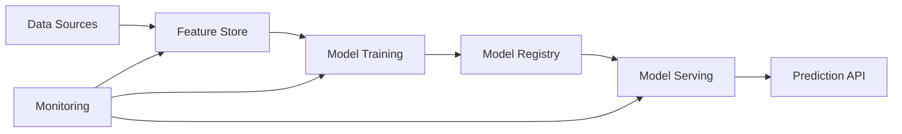

# 🚀 Quick Reference Guide

> **Instant access to key concepts, formulas, and decision frameworks for ML interviews**

## 📊 Essential Metrics Cheatsheet

### Classification Metrics
```
Precision = TP / (TP + FP)    # Of predicted positive, how many are correct?
Recall    = TP / (TP + FN)    # Of actual positive, how many did we find?
F1 Score  = 2 * (P * R) / (P + R)
Accuracy  = (TP + TN) / (TP + TN + FP + FN)

ROC-AUC: Area under ROC curve (TPR vs FPR)
PR-AUC:  Area under Precision-Recall curve
```

### Regression Metrics
```
MAE  = Σ|y_true - y_pred| / n     # Mean Absolute Error
RMSE = √(Σ(y_true - y_pred)² / n) # Root Mean Square Error  
MAPE = Σ|y_true - y_pred|/|y_true| / n * 100  # Mean Absolute Percentage Error
R²   = 1 - SS_res/SS_tot          # Coefficient of Determination
```

### Ranking Metrics
```
NDCG@k = DCG@k / IDCG@k
DCG@k  = Σ(2^rel_i - 1) / log₂(i + 1)  # Discounted Cumulative Gain
MAP    = Σ(P@k * rel_k) / |relevant|   # Mean Average Precision
MRR    = 1/|Q| * Σ(1/rank_i)           # Mean Reciprocal Rank
```

## 🧮 Key Algorithms Decision Tree

```
Problem Type?
├── Classification
│   ├── Linear Separable? → Logistic Regression, SVM
│   ├── Tabular Data? → Random Forest, XGBoost
│   ├── High Dimensional? → Naive Bayes, Linear SVM
│   ├── Complex Patterns? → Neural Networks
│   └── Interpretable? → Decision Trees, Logistic Regression
│
├── Regression  
│   ├── Linear Relationship? → Linear Regression
│   ├── Non-linear? → Polynomial, Kernel Methods
│   ├── High Dimensional? → Ridge, Lasso, Elastic Net
│   ├── Tabular Data? → Random Forest, XGBoost
│   └── Complex Patterns? → Neural Networks
│
├── Clustering
│   ├── Known K? → K-Means
│   ├── Density-based? → DBSCAN
│   ├── Hierarchical? → Agglomerative, Divisive
│   └── High Dimensional? → Spectral Clustering
│
└── Recommendation
    ├── Cold Start? → Content-based, Demographic
    ├── Collaborative? → Matrix Factorization, CF
    ├── Hybrid? → Weighted, Switching, Mixed
    └── Real-time? → Two-tower, Candidate Generation
```

## ⚡ Bias-Variance Trade-off

| Aspect | High Bias | High Variance | Balanced |
|--------|-----------|---------------|----------|
| **Model Complexity** | Too Simple | Too Complex | Just Right |
| **Training Error** | High | Low | Medium |
| **Validation Error** | High | High | Low |
| **Symptoms** | Underfitting | Overfitting | Good Generalization |
| **Solutions** | More features, complex model | Regularization, more data | Cross-validation tuning |
| **Examples** | Linear model for non-linear data | Deep NN on small dataset | Properly tuned RF |

## 🔧 System Design Patterns

### Batch vs Real-time Decision Matrix

| Requirement | Batch | Real-time | Hybrid |
|-------------|-------|-----------|---------|
| **Latency** | Hours/Days | <100ms | Mixed |
| **Throughput** | Very High | Medium | High |
| **Cost** | Low | High | Medium |
| **Complexity** | Low | High | Very High |
| **Use Cases** | Recommendations, Reports | Fraud, Ads | Personalization |

### Architecture Components


## 📈 A/B Testing Framework

### Sample Size Calculation
```
n = (Z_α/2 + Z_β)² * 2 * p * (1-p) / (p₁-p₀)²

Where:
- Z_α/2: Critical value for significance level (1.96 for 95%)
- Z_β: Critical value for power (0.84 for 80% power)  
- p: Baseline conversion rate
- p₁-p₀: Minimum detectable effect
```

### Statistical Tests Quick Reference
| Data Type | Comparison | Test |
|-----------|------------|------|
| Continuous | 2 groups | t-test |
| Continuous | >2 groups | ANOVA |
| Categorical | 2 proportions | Chi-square |
| Non-parametric | 2 groups | Mann-Whitney U |
| Paired | Before/After | Paired t-test |

## 🐛 Debugging Playbook

### Performance Drop Investigation
```
1. Data Issues
   ├── Check feature drift (KS test, PSI)
   ├── Verify label quality  
   ├── Look for data leakage
   └── Validate data pipeline

2. Model Issues  
   ├── Compare train vs validation performance
   ├── Check hyperparameter drift
   ├── Verify model serving consistency
   └── Test feature importance changes

3. System Issues
   ├── Monitor latency and throughput
   ├── Check cache hit rates
   ├── Validate A/B test setup
   └── Review infrastructure changes
```

### Common ML Failure Modes
| Symptom | Likely Cause | Quick Check | Solution |
|---------|--------------|-------------|----------|
| High Bias | Model too simple | Train error high | More features, complex model |
| High Variance | Overfitting | Large train/val gap | Regularization, more data |
| Label Leakage | Future info in features | Perfect accuracy | Remove leaked features |
| Data Drift | Distribution shift | Feature stats change | Retrain model |
| Serving Skew | Train/serve mismatch | Predictions differ | Fix feature pipeline |

## 🎯 Interview Answer Templates

### Problem Framing Template
```
1. Clarify Business Objective
   - What metric are we optimizing?
   - What are the constraints?
   - What's the success criteria?

2. Define ML Problem  
   - Classification/Regression/Ranking?
   - What's the input/output?
   - What data is available?

3. Success Metrics
   - Online metrics (business KPIs)
   - Offline metrics (ML evaluation)
   - Guardrail metrics (safety)
```

### System Design Template  
```
1. Requirements Gathering
   - Scale (QPS, latency, users)
   - Data characteristics
   - Business constraints

2. High-level Architecture
   - Data pipeline
   - Training system  
   - Serving system
   - Monitoring system

3. Deep Dive Components
   - Feature engineering
   - Model selection
   - Serving infrastructure
   - A/B testing framework

4. Scale & Optimize
   - Bottleneck analysis
   - Caching strategies
   - Distributed systems
```

## 💡 Common Formulas

### Information Theory
```
Entropy:     H(X) = -Σ p(x) * log₂(p(x))
Mutual Info: I(X;Y) = H(X) - H(X|Y) = H(Y) - H(Y|X)
KL Divergence: D_KL(P||Q) = Σ P(x) * log(P(x)/Q(x))
Cross Entropy: H(P,Q) = -Σ P(x) * log(Q(x))
```

### Loss Functions
```
MSE:           L = (y - ŷ)²
MAE:           L = |y - ŷ|  
Cross-Entropy: L = -y*log(ŷ) - (1-y)*log(1-ŷ)
Hinge Loss:    L = max(0, 1 - y*ŷ)
Focal Loss:    L = -α(1-p_t)^γ * log(p_t)
```

### Regularization
```
Ridge (L2):    λ * Σ θᵢ²
Lasso (L1):    λ * Σ |θᵢ|
Elastic Net:   λ₁ * Σ |θᵢ| + λ₂ * Σ θᵢ²
Dropout:       Randomly set neurons to 0 with prob p
```

## 🏢 Company-Specific Focus

### Meta/Facebook
- **Focus**: Feed ranking, ads optimization, content understanding
- **Key Topics**: Two-tower models, embedding systems, real-time ML
- **Scale**: Billions of users, <100ms latency requirements

### Google  
- **Focus**: Search relevance, ads auction, YouTube recommendations
- **Key Topics**: Learning to rank, BERT integration, distributed systems
- **Scale**: Global infrastructure, multi-language, diverse queries

### Netflix
- **Focus**: Content recommendation, personalization, A/B testing
- **Key Topics**: Collaborative filtering, cold start, diversity optimization  
- **Scale**: 200M+ subscribers, global content catalog

### Amazon
- **Focus**: Product recommendations, search relevance, supply chain
- **Key Topics**: Real-time personalization, inventory optimization
- **Scale**: E-commerce at global scale, diverse product catalog

### Apple
- **Focus**: On-device ML, privacy-preserving ML, Siri/search
- **Key Topics**: Federated learning, model compression, edge computing
- **Scale**: Billions of devices, privacy constraints

## 📱 Mobile/Quick Access Cards

### Algorithm Comparison (60 seconds)
| Algorithm | Pros | Cons | When to Use |
|-----------|------|------|-------------|
| **Logistic Regression** | Fast, interpretable | Linear only | Baseline, simple problems |
| **Random Forest** | Robust, handles missing data | Can overfit | Tabular data, feature importance |
| **SVM** | Good for high-dim | Slow on large data | Text, high-dimensional |
| **Neural Networks** | Universal approximator | Needs lots of data | Images, text, complex patterns |
| **XGBoost** | High performance | Hyperparameter sensitive | Competitions, structured data |

### Metric Selection (30 seconds)
- **Imbalanced Classification**: Precision, Recall, F1, PR-AUC  
- **Balanced Classification**: Accuracy, ROC-AUC
- **Regression**: MAE (robust), RMSE (penalize outliers)
- **Ranking**: NDCG, MAP (relevance matters)
- **Recommendation**: CTR, Diversity, Coverage

### Red Flags (15 seconds)
- 🚨 Perfect accuracy → Label leakage
- 🚨 Train >> Val performance → Overfitting  
- 🚨 Sudden performance drop → Data drift
- 🚨 High latency spikes → Infrastructure issues
- 🚨 Biased predictions → Fairness problems

---

*Keep this guide handy during interviews for quick reference and confidence boosts!*